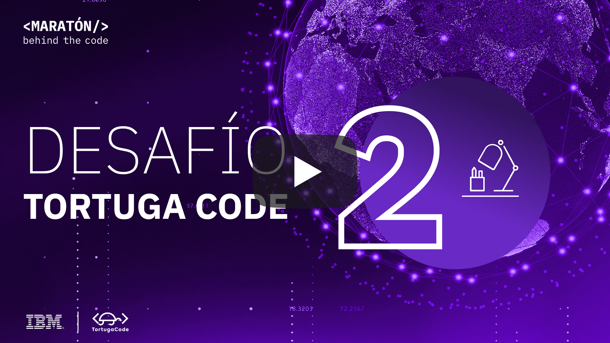
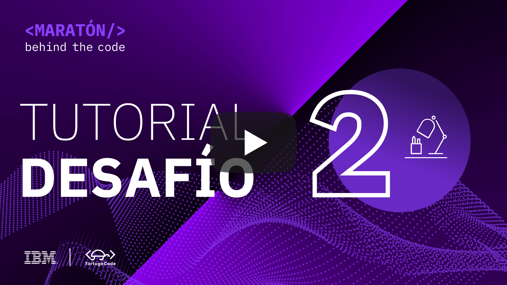
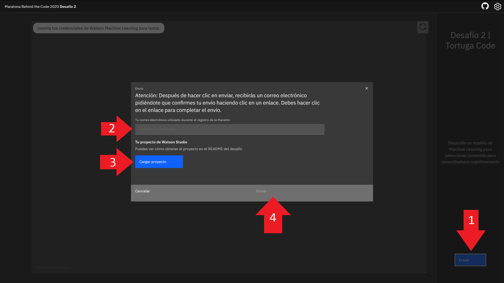

# Desafio 02 | Tortuga Code

- [1. Acerca de Tortuga Code](#1-acerca-de-tortuga-code)
- [2. Reto de negocio](#2-reto-de-negocio)
- [3. Objetivo](#3-objetivo)
- [4. Desarrollando la solución](#4-desarrollando-la-solución)
  - [4.1. Pre-requisitos](#41-pre-requisitos)
  - [4.2. Resumen de las tareas](#42-resumen-de-las-tareas)
  - [4.3. Desarrollo](#43-desarrollo)
- [5. Envío](#5-envío)
- [6. Sobre la evaluación](#6-sobre-la-evaluación)

## Para Ayudarte

- [Material de apoyo](#material-de-apoyo)
- [Solución de problemas](#solución-de-problemas)
- [Licencia](#licencia)

## 1. Acerca de Tortuga Code

Tortuga Code – es una plataforma de educación on-line y gratuita para todas y todos, enfocada en el aprendizaje de programación y tecnología.

    

## 2. Reto de negocio

El desafío que propone Tortuga Code tiene que ver con la usabilidad del portal y cómo las personas podrían sacarle mayor provecho al mismo. Hoy en día en el portal se pueden encontrar diferentes contenidos técnicos como cursos, blogs y videos los cuales pueden ser buscados y consumidos sin ningún criterio de personalización.
Lo que busca  Tortuga Code, teniendo en cuenta el potencial que hoy ofrece la Inteligencia Artificial, es ofrecerle a los usuarios una experiencia diferente donde puedan encontrar el contenido más adecuado para ellos. Para eso, se quiere crear un catálogo de contenido donde el usuario, en base a sus skills y conocimiento previo, pueda encontrar recomendaciones y contenido personalizado.

Los participantes deberán utilizar la tecnología de IBM Watson Studio en IBM Cloud para crear este catálogo de contenido y así ayudar a los estudiantes de Tortuga Code a encontrar el material más adecuado, según su experiencia y conocimiento previo.

## 3. Objetivo

En este desafío, TORTUGA CODE traerá herramientas de IBM, como Watson Machine Learning y Cloud Pak for Data, para construir un modelo basado en el aprendizaje automático e integrarlo con una solución de asistente virtual, centrado en la recomendación de contenidos y cursos personalizados. Tu tarea será mejorar un modelo ya proporcionado e integrar los diversos servicios involucrados en esta solución!

La idea esencial del **Desafío 2** es crear un modelo basado en machine learning capaz de identificar las principales deficiencias del estudiante, permitiendo una tutoría personalizada del estudiante. Para simplificar el problema, se centrarán en los datos de tres asignaturas del curso de Tecnología: Data Science, Backend Web y Front end Web . El participante trabajará con un conjunto de datos sintéticos proporcionados y creará una "pipeline", es decir, una cadena de pasos de pre-procesamiento y un modelo de clasificación. En este repositorio el archivo ``cloud-pak-project-es-2.zip`` contiene un proyecto completo en Watson Studio ya con una solución básica lista, totalmente funcional. Puedes (y se recomienda) mejorar el modelo para obtener una mayor puntuación :)

## 4. Desarrollando la solución

### 4.1. Pre-requisitos

Para poder realizar este desafío, se deben cumplir con los siguientes requisitos previos:

- Regístrate en [Maratón Behind the Code](https://maratona.dev/es) y confirma tu e-mail de registro.
- Tener una cuenta en [IBM Cloud](https://ibm.biz/registro-maratona), que puede ser una cuenta GRATUITA o de pago (no es necesario registrarse en el evento con el mismo correo electrónico utilizado para crear tu cuenta IBM Cloud).

### 4.2. Resumen de las tareas

1. Instanciar Watson Studio (Cloud Pak for Data as a Service) en IBM Cloud.
2. Instanciar Watson Machine Learning en IBM Cloud.
3. Instanciar Cloud Object Storage en IBM Cloud.
4. Importar el proyecto proporcionado en este repositorio (``cloud-pak-project-es-2.zip``) en Watson Studio.
5. Leer y ejecutar las instrucciones contenidas en el Notebook ``parte-1.ipynb``.
6. Leer y ejecutar las instrucciones contenidas en el Notebook ``parte-2.ipynb``.
7. Acceder a https://tortuga.maratona.dev/, probar y envíar su solución.

### 4.3. Desarrollo

La idea esencial del **Desafío 2** es crear un modelo basado en machine learning capaz de identificar las principales deficiencias del estudiante, permitiendo una tutoría personalizada del estudiante. Para simplificar el problema, se centrarán en los datos de tres asignaturas del curso de Tecnología: Data Science, Backend Web y Frontend Web. El participante trabajará con un conjunto de datos sintéticos proporcionados y creará una "pipeline", es decir, una cadena de pasos de pre-procesamiento y un modelo de clasificación. 

En este repositorio el archivo ``cloud-pak-project-es-2.zip`` contiene un proyecto completo en Watson Studio ya con una solución básica lista, totalmente funcional. Puedes (y se recomienda) mejorar el modelo para obtener una mayor puntuación :)

En el video a continuación, se explica en detalle todo el proceso de desarrollo de la solución. Si eres un principiante en el mundo de la ciencia de datos y  *machine learning*, te recomendamos que veas el video para responder cualquier pregunta sobre este desafío.

    

## 5. Envío

Para hacer la entrega, debes acceder a la siguiente solicitud: https://tortuga.maratona.dev/ y rellenar el formulario con las credenciales de tu instancia de **Watson Machine Learning** y la **URL para la puntuación de tu modelo**. En esta página podrás interactuar con un asistente virtual creado con Watson Assistant, ya integrado en tu modelo de Machine Learning - siempre y cuando las credenciales y la URL de puntuación funcionen :)

</a>

🚨 **PRUEBA TU SOLUCIÓN ANTES DE PRESENTARLA** 🚨

Después de realizar las pruebas, haz clic en el botón en la esquina inferior derecha para ENVIAR TU SOLUCIÓN, como se muestra en la imagen a continuación, y completA el formulario con su dirección de correo electrónico con la que te registraste en MARATÓN 2020. No olvides cargar tu archivo .zip del proyecto en Watson Studio.

</a>

## 6. Sobre la evaluación

En esencia, el reto puntuará la calidad de tu modelo, sin embargo debe estar alojado en Watson Machine Learning, y no sólo contenido en forma de código en los notebooks proporcionados. Nuestro sistema de evaluación automática calculará la métrica de precisión y calificará tu solución según la calidad del modelo presentado. Como se explica en el vídeo anterior, el problema que debe resolver el modelo de machine learning es un problema clásico de clasificación de clases múltiples, y se encuentran más detalles en los notebooks jupyter proporcionados.

El tiempo de entrega no se incluye en el cálculo de la puntuación del desafío. Sin embargo, para todos los participantes que presenten este desafío en la primera semana después del lanzamiento, recibirán una bonificación del 10% de la puntuación final.

## Material de apoyo

- [Una guía del portal de IBM Developer para principiantes del Machine Learning](https://developer.ibm.com/es/patterns/use-icp4d-to-build-the-machine-learning-model-for-return-propensity/)

## Solución de problemas

Mira el [video explicativo](#43-desarrollo) provisto en la Sección 4, o si lo deseas, revisa la documentación de los servicios involucrados en este desafío:

- [IBM Cloud Pak for Data as a Service (Watson Studio)](https://dataplatform.cloud.ibm.com/docs/content/wsj/getting-started/welcome-main.html?audience=wdp&context=cpdaas)
- [IBM Watson Machine Learning](https://dataplatform.cloud.ibm.com/docs/content/wsj/analyze-data/ml-overview.html)

Accede al discord oficial de la Maratón 2020 para hacer preguntas y/o interactuar con otros participantes: [Discord](https://discord.gg/Q9At74C).

## Licencia

Copyright 2020 Maratona Behind the Code

Licensed under the Apache License, Version 2.0 (the "License");
you may not use this file except in compliance with the License.
You may obtain a copy of the License at

       http://www.apache.org/licenses/LICENSE-2.0

Unless required by applicable law or agreed to in writing, software
distributed under the License is distributed on an "AS IS" BASIS,
WITHOUT WARRANTIES OR CONDITIONS OF ANY KIND, either express or implied.
See the License for the specific language governing permissions and
limitations under the License.
